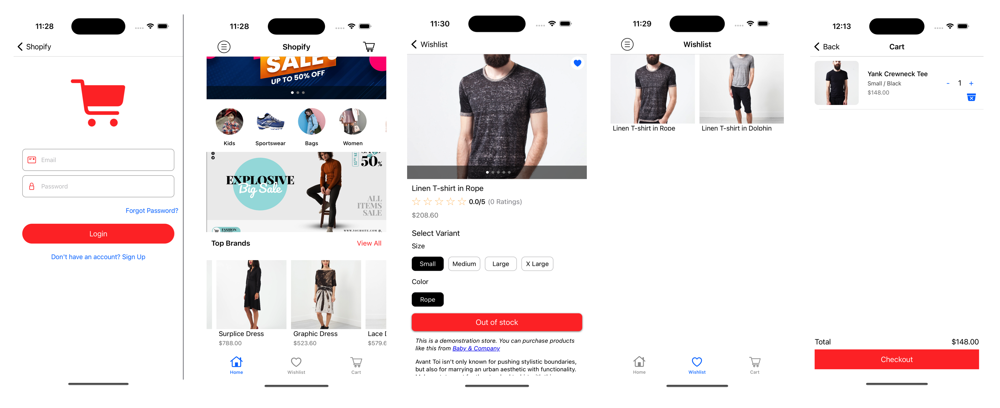

# Shopify (Demo App)

Built with Swift, this app provides a robust and intuitive shopping experience for your customers on iOS.

### Credits

* Shopify iOS Buy SDK: https://shopify.dev/docs/storefronts/headless/mobile-apps/buy-sdk-ios
* UIKit Framework: https://developer.apple.com/documentation/uikit
* Push Notifications: https://github.com/CrossGeeks/MultilingualPlugin
* CoreGraphics Framework: https://developer.apple.com/documentation/coregraphics
* Firebase: https://firebase.google.com/docs/ios/learn-more